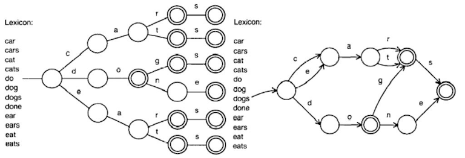

# BlueHeron.Collections.CharTrie

## Introduction

The CharTrie is a combination of a Trie and a directed acyclic word graph (DAWG) that results in a very compact representation of a list of words that allows for very fast search operations.

The available Find function accepts a PatternMatch object that enables the standard searches equivalent to '==', 'StartsWith' and 'EndsWith', but also more complex patterns, e.g.: '2nd letter is 'A' AND 4th letter is 'O' OR 'Ö'.

The Tests project's functions demonstrate these possibilities in detail.
A CharTrieFactory is also available that helps in creating (new or from a word list) and (de-)serializing CharTrie objects to and from a file or stream.

## Concept

Representing a list of words as a tree structure, followed by prefix and suffix grouping.

## Usage

See [Trietest.cs](https://github.com/TheBlueHeron/BlueHeron.Collections.CharTrie/blob/master/BlueHeron.Collections.CharTrie.Tests/TrieTests.cs) for details on how to use the code.

## Benchmark ([history](BENCHMARKS.md))

### TestContext Messages:

Using diagnostic tools snapshot:

|----------|---------|------------|
|  Object  | # Nodes |       Size |
|----------|---------|------------|
|     List |  343075 | 20482984 B |
|----------|---------|------------|
| CharTrie |  196782 |  4260336 B |
|----------|---------|------------|

|--------------------------|--------|-----------------|-----------------|-----------------|----------------|-----------|
|                Operation | # Runs | Minimum (µsec.) | Maximum (µsec.) | Average (µsec.) | Median (µsec.) | Avg Diff. |
|--------------------------|--------|-----------------|-----------------|-----------------|----------------|-----------|
|            List Contains |    344 |             1,8 |          3057,5 |           914,9 |         1510,0 |           |
|        CharTrie Contains |    344 |             0,8 |           316,7 |             4,7 |           13,1 |     195 x |
|--------------------------|--------|-----------------|-----------------|-----------------|----------------|-----------|
|          List StartsWith |     10 |         69691,2 |         76073,5 |         72441,4 |        73512,3 |           |
|    CharTrie Find(prefix) |     10 |            91,4 |          4002,8 |           684,9 |          666,7 |     106 x |
|--------------------------|--------|-----------------|-----------------|-----------------|----------------|-----------|
|            List EndsWith |      5 |        119530,2 |        175836,8 |        134681,2 |       129874,9 |           |
|    CharTrie Find(suffix) |      5 |          4181,8 |         15128,9 |          8698,2 |        14567,0 |    15.5 x |
|--------------------------|--------|-----------------|-----------------|-----------------|----------------|-----------|
|               List Regex |      3 |         64578,2 |         75044,4 |         70848,4 |        64578,2 |           |
|   CharTrie Find(pattern) |      3 |          4833,9 |          8261,3 |          6401,6 |         6109,7 |    11.1 x |
|--------------------------|--------|-----------------|-----------------|-----------------|----------------|-----------|
